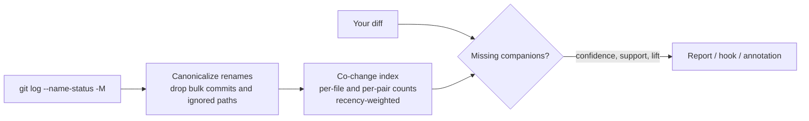

<h1 align="center">cochange</h1>

<p align="center"><b>Flags the files you forgot to change, learned from your own git history.</b></p>

<p align="center">
  <a href="https://github.com/Nithinfgs/cochange/actions/workflows/ci.yml"></a>
  <a href="LICENSE"></a>
  
  
</p>

<p align="center"></p>

## In 20 seconds

You edit `src/routes/invoices.ts`. In 9 of the last 9 commits that touched it, `tests/invoices.test.ts` and `docs/api/invoices.md` changed too. This time they didn't.

`cochange` reads your git history, learns which files move together, and tells you which companions are missing from your current change. No config, no network, no API keys, and no language-specific parsing. It works on anything git can diff.

```sh
npx cochange            # check your uncommitted changes
npx cochange backtest   # measure how trustworthy the signal is for THIS repo
```

## Why

Some knowledge never makes it into a linter or a CONTRIBUTING file: "if you touch the route, also touch the OpenAPI spec", "migrations need `schema.sql`", "this registry has a twin in `docs/`". It lives in git history, and nothing reads it back at the moment you need it.

It matters more with coding agents. An agent edits the file you pointed it at, runs the tests that already exist, and stops. It has no memory of the conventions your team keeps in its head. `cochange` ships a Claude Code Stop hook that hands those conventions back to the agent as a short list before it declares victory.

## Quick start

Requires Node 20+ and git. Run it from inside any git repository:

```sh
npx cochange                      # all uncommitted changes (the default)
npx cochange --staged             # only what is staged
npx cochange --base origin/main   # everything on this branch, for PRs
npx cochange of src/api.ts        # what usually changes together with a file
npx cochange report -o report.html   # shareable coupling map
```

Or install it: `npm install -g cochange`.

### Check how much to trust it first

Co-change signals are strong in some repos and noise in others. Rather than guess, replay your own history:

```sh
$ npx cochange backtest --sweep      # output shown is from django/django
cochange backtest · 300 recent commits, 1,153 held-out files, trained on earlier history only

  At 80% confidence (your current setting):
      6%  of forgotten files would have been flagged
     33%  of flags pointed at the forgotten file
      6%  of complete commits would still draw a warning
  ...
```

For each recent commit it trains on earlier history only, hides one file at a time, and checks whether the tool would have flagged it. It also runs the check on the complete commit to measure how often it would have nagged for nothing.

## Honest numbers

Measured on four large public repositories at the default 80% confidence (reproduce with [`scripts/validate-oss.sh`](scripts/validate-oss.sh)):

| Repo          | Forgotten files flagged | Flags that were right | Complete commits that still warn |
| ------------- | ----------------------- | --------------------- | -------------------------------- |
| pallets/flask | 10%                     | 28%                   | 7%                               |
| psf/requests  | 7%                      | 28%                   | 4%                               |
| django/django | 6%                      | 33%                   | 6%                               |
| rails/rails   | 5%                      | 34%                   | 10%                              |

Read this as a **tripwire, not an oracle**. It catches the minority of misses that follow a strong, repeated convention, and it will occasionally warn about a file you correctly left alone. It works best where conventions are strict (changelogs, generated artifacts, test and doc pairs, registries, migrations). That is why it ships as a hook and a CI annotation rather than a blocking gate. Details and caveats: [docs/VALIDATION.md](docs/VALIDATION.md).

## Features

- **Companion check**: compares your working tree, staged changes, or a whole branch against history.
- **Backtest**: leave-one-out replay on your repo, with a threshold sweep, so you tune with data instead of guessing.
- **Follows renames**: history survives `git mv`.
- **Noise control**: skips bulk commits, lockfiles and vendored paths, discounts files that change in nearly every commit (lift), and weights recent history more heavily.
- **Agent hook**: a Claude Code Stop hook that nudges once, then gets out of the way.
- **CI-ready output**: GitHub annotations, PR-comment Markdown, JSON, and an opt-in `--strict` exit code.
- **Coupling report**: a self-contained HTML page with a force-directed map of your hidden dependencies.

## Use it where it fits

```sh
cochange hook claude       # Claude Code Stop hook snippet
cochange hook pre-commit   # git pre-commit hook (warns, never blocks unless --strict)
cochange hook github       # GitHub Actions workflow with inline annotations
```

Claude Code (`.claude/settings.json`):

```json
{
  "hooks": {
    "Stop": [
      { "hooks": [{ "type": "command", "command": "npx -y cochange check --hook claude-stop" }] }
    ]
  }
}
```

When the agent tries to stop with a suspicious gap, the hook exits with code 2 and the message goes back to the agent. It fires at most once per stop, so the agent can answer "not needed because…" and finish.

## How it works



For a changed file `A` and a candidate `B` that is not in your change:

- **confidence** = weighted share of the commits touching `A` that also touched `B`
- **support** = number of commits that touched both (default minimum 4)
- **lift** = confidence divided by how often `B` changes at all (default minimum 2), which filters files like `CHANGELOG` that change in many commits for unrelated reasons

A suggestion needs all three. When several changed files point at the same missing file, the strongest wins and the evidence is listed. For `--base`, history is read only up to the branch's merge-base, so a PR's own commits never vouch for themselves. More in [docs/HOW-IT-WORKS.md](docs/HOW-IT-WORKS.md).

## Configuration

Defaults work without a file. To tune, add `.cochange.json` at the repo root (see [`.cochange.example.json`](.cochange.example.json)):

```json
{
  "minConfidence": 0.8,
  "minSupport": 4,
  "minLift": 2,
  "maxFiles": 25,
  "halfLifeDays": 365,
  "maxCommits": 3000,
  "ignore": ["docs/generated/**"],
  "ignorePairs": [["src/legacy.ts", "docs/legacy.md"]]
}
```

Every setting is also a flag (`--min-confidence`, `--min-support`, `--half-life`, ...). Run `cochange --help` for the full list. Exit codes: `0` ok, `1` findings with `--strict`, `2` findings in Claude hook mode, `64` usage or config error.

## Prior art

The idea of mining co-changes is old and well studied ("logical coupling"). [code-maat](https://github.com/adamtornhill/code-maat) and [CodeScene](https://codescene.com/) analyze coupling across a codebase, and several small tools list co-changing pairs. `cochange` is narrower: it answers one question about the change in front of you, runs as a hook, and measures its own accuracy on your repo.

## Limitations

- Needs real history. Fresh repos, squashed imports and files with fewer than four past commits produce no suggestions.
- It sees file names, not meaning. It cannot know _why_ two files move together.
- Very large histories are capped at `maxCommits` (default 3000, newest first).
- A pair that stopped changing together recently takes a while to fade; lower `halfLifeDays` to adapt faster.

## Roadmap

- [ ] Group-aware rules ("when A and B both change, C follows")
- [ ] Path-pattern rules that generalize to brand-new files (`src/<x>.ts` pairs with `tests/<x>.test.ts`)
- [ ] Cached index for very large monorepos
- [ ] Hook recipes for Codex CLI, Cursor and Gemini CLI
- [ ] GitHub Action with sticky PR comment

Have a use case that isn't covered? Open an issue.

## Contributing

Bug reports with a small repro are the most valuable contribution. See [CONTRIBUTING.md](CONTRIBUTING.md). The codebase is small (about 1,200 lines of TypeScript, no runtime dependencies) and tests run against real temporary git repositories.

```sh
git clone https://github.com/Nithinfgs/cochange && cd cochange
npm install && npm test
```

## License

[MIT](LICENSE)
